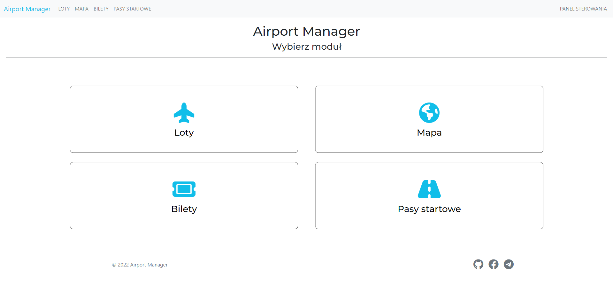
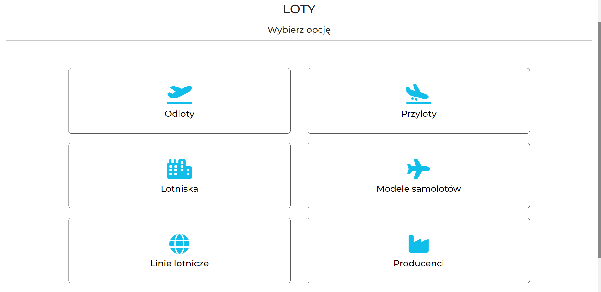
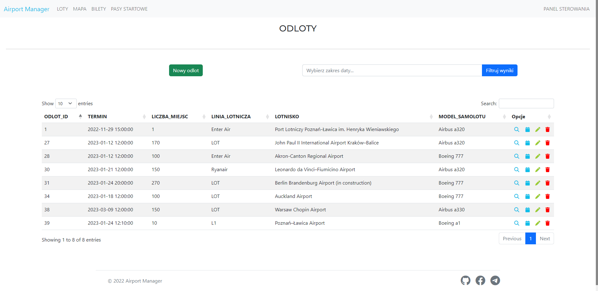
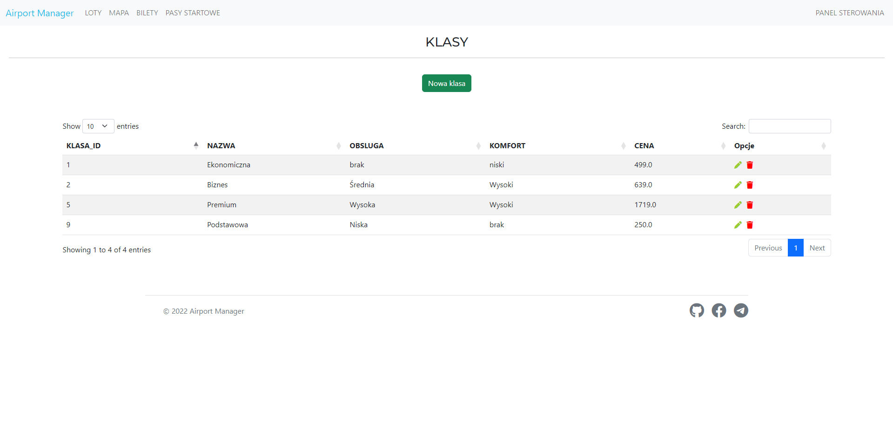
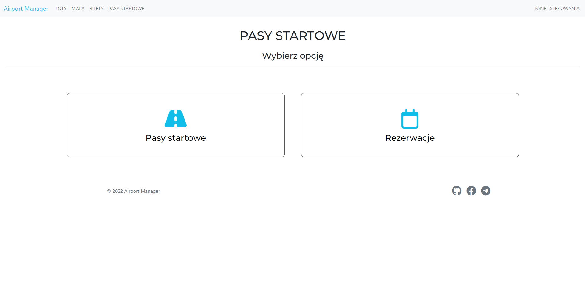
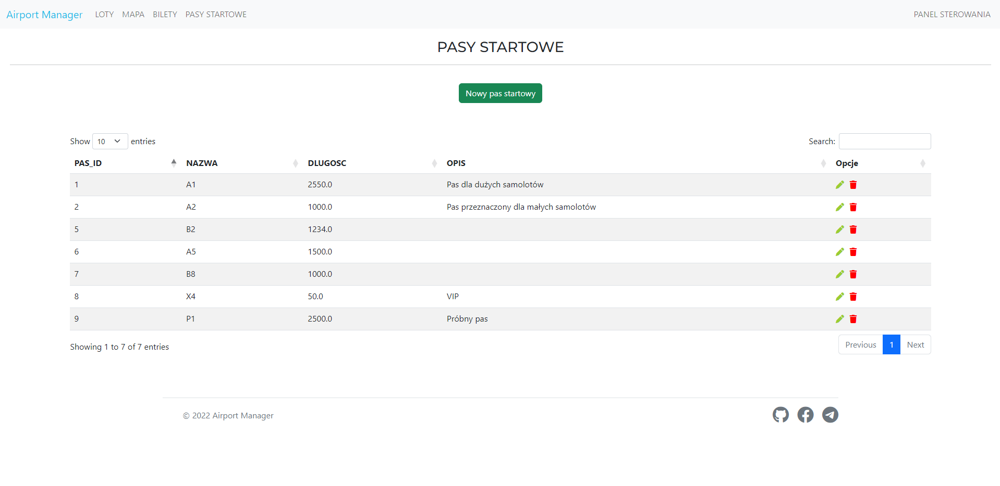
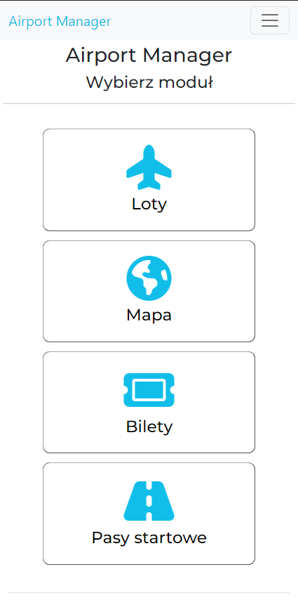
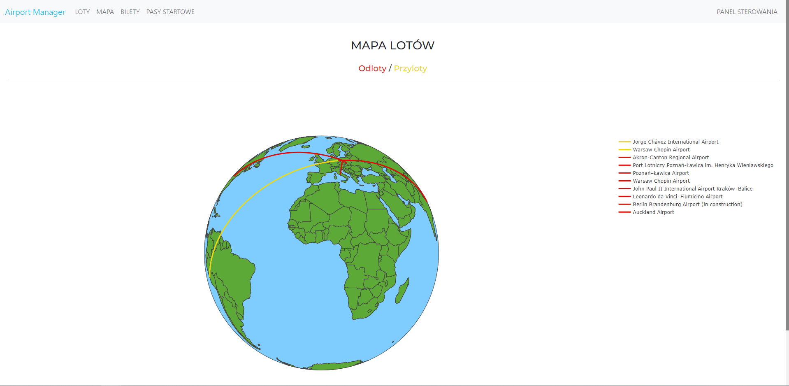
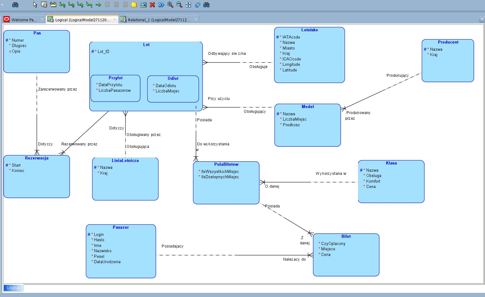

# Airport Manager

Airport Manager is an application that allows users to manage an airport.

It includes features such as managing departures, arrivals, passengers, and tickets. Overall, it is a comprehensive tool
for airport management and organization.

## Table of contents

1. [Description](#Description)
2. [How to run the app](#Run)
3. [Technical information](#Technical)
4. [Contact](#Contact)

## Description

### How does the app look like and what the user can see and do?

Airport Manager has 3 main modules:

1. [Flights](#Flights)
2. [Tickets](#Tickets)
3. [Runways](#Runways)



#### Flights

In the `Flights` module the user can create, read, update and delete data related to arrivals, departures, airports,
airplane models, airplane manufacturers and airlines.



After choosing an option, for example `departures`, the user can see a table presenting data available in the
database. \
The same goes for every other option mentioned above.



#### Tickets

In the `Tickets` module the user can create, read, update and delete data related to tickets, ticket pools, ticket
classes and passengers.


After choosing an option, for example `classes`, the user can see a table presenting data available in the database. \
The same goes for every other option mentioned above.



#### Runways

In the `Runways` module the user can create, read, update, and delete data related to runways and runways' reservations.
\



After choosing and option, for example `runways`, the user can see a table presenting data available in the database. \



### Mobile support

The app is fully supported on mobile devices.



### Map

A cool feature of the Airport Manager is a map that visualizes current flights.



## Run

Before running the app for the first time, you have to take some additional steps:

1. Clone the repository to your local machine

```commandline
git clone https://github.com/anras5/AirportManager.git
```

2. Install [Python](https://www.python.org/) in version >=3.8
3. Open the terminal in the root level of the repository and type

```commandline
python -m venv venv
cd venv/Scripts
.\activate.bat
```

This step may vary depending on your operating system - the example above should work for Windows but is very similar on
Linux.

4. Go back to the root level and download libraries from `requirements.txt`

```commandline
pip install -r requirements.txt
```

5. Install `cx_Oracle` binaries (Instant Client). More information
   on [cx_Oracle documentation](https://cx-oracle.readthedocs.io/en/latest/user_guide/installation.html#:~:text=To%20get%20the%20libraries%3A)
6. Create a `.env` file in the root level on the repository. The `.env` file should look like `.env-example` file. Fill
   all of the values. To use RAPID-API for getting data for airports you might have to create an account
   on [Rapid API](https://rapidapi.com/hub)
7. Run DDL file located in `database/DDL.ddl` in a program in which you connect to your Oracle database (for example
   DBeaver). It will create tables and objects in your Oracle database that will be required for the app to work
   properly.
8. Run `run.bat` file

```commandline
.\run.bat
```

If you want to run the app for the second, third, ... time, you can simply just run the `run.bat` file just like in the
8th point.

## Technical

### Database - Oracle

ER Diagram of the database



### Backend - Python 3.8

Libraries and packages used in Python:

1. Flask
2. cx_Oracle
3. requests

### Frontend - Jinja2 templates / HTML and Javascript

Javascript libraries:

1. SweetAlert
2. Notie
3. Flatpickr
4. Plotly

HTML additions:

1. Bootstrap
2. Font Awesome


## Contact

anras1filip@gmail.com
